<div align="center">


<h1>Azure Virtual Desktop (AVD) Cost Optimizer</h1>

<p><strong>Enterprise FinOps Control Plane & Intelligent Resource Orchestration</strong></p>

[](https://finops.org)
[](https://devopstrio.co.uk/)
[](/apps/policy-engine)
[](https://devopstrio.co.uk/)

</div>

---

## 🏛️ Executive Summary

The **AVD Cost Optimizer** is a flagship enterprise platform designed to maximize the return on investment for Azure Virtual Desktop environments. In large-scale VDI estates, compute waste and inefficient storage tiering can account for up to 60% of unnecessary cloud spend. 

This platform provides an intelligent orchestration layer that combines **real-time usage analytics**, **predictive demand forecasting**, and **automated rightsizing** to ensure that every cent spent on AVD is optimized. By bridging the gap between infrastructure operations and financial accountability, it empowers organizations to run high-performance digital workspaces while maintaining strict budget governance.

### Strategic Business Outcomes
- **Massive Cost Reduction**: Achieve up to 45% annual savings on AVD compute through intelligent deallocation and reserved instance alignment.
- **Improved FinOps Visibility**: Provide granular chargeback and showback reports to department heads, driving cultural accountability for resource consumption.
- **Sustainable IT Operations**: Reduce data center carbon footprint by aligning session host availability with actual work patterns.
- **Predictive Budgeting**: Eliminate "cloud bill shock" with AI-driven forecasting that detects seasonal growth trends before they impact the bottom line.

---

## 🏗️ Technical Architecture Details

### 1. High-Level FinOps Architecture
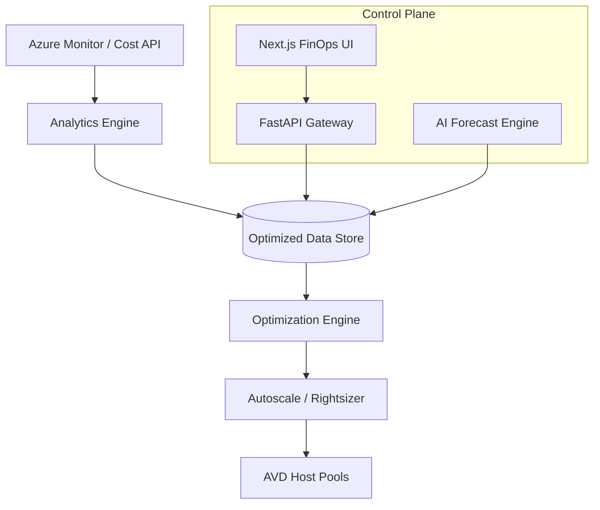

### 2. Cost Ingestion & Normalization Workflow
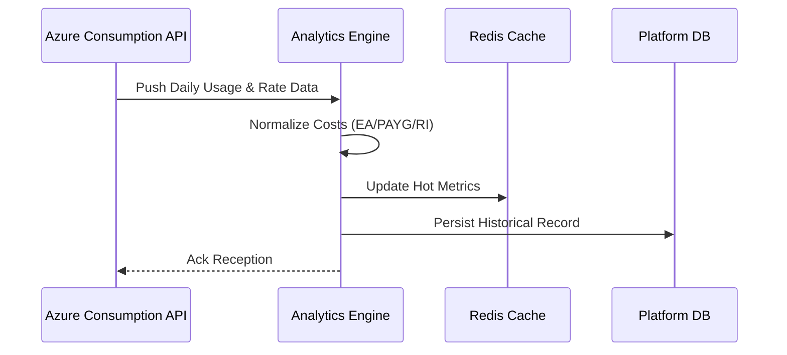

### 3. Rightsizing Lifecycle
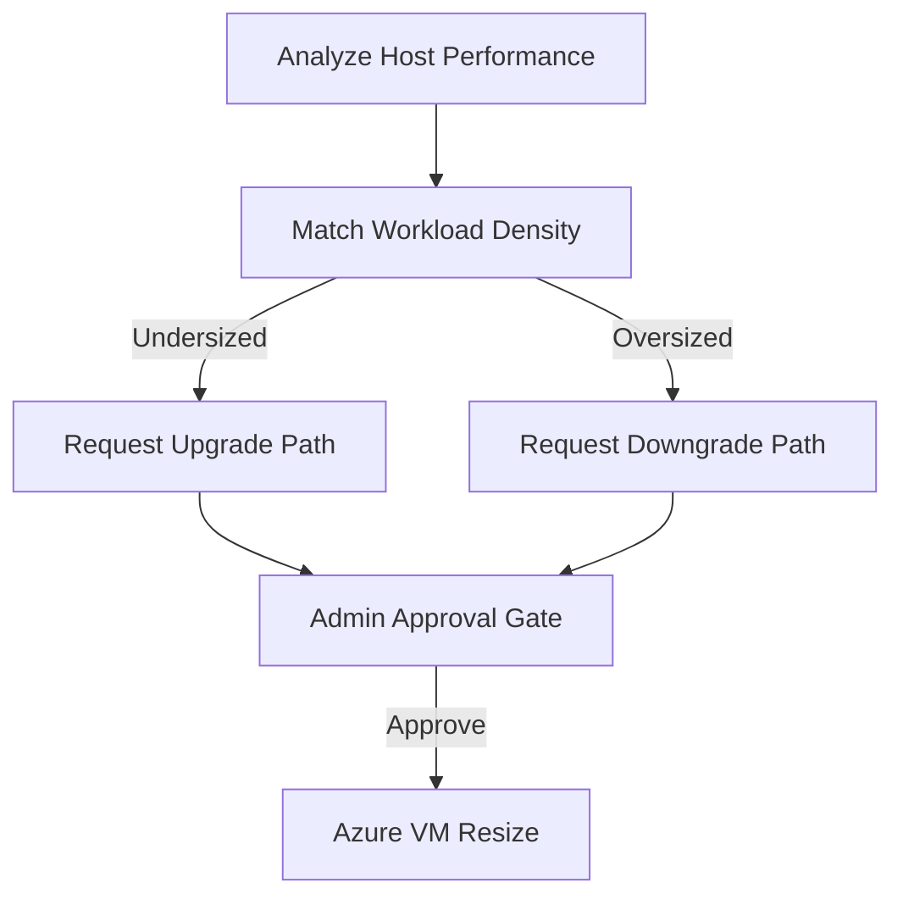

### 4. Host Pool Autoscale Flow
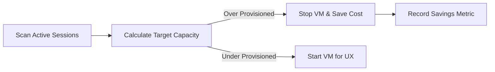

### 5. Forecast Model Flow
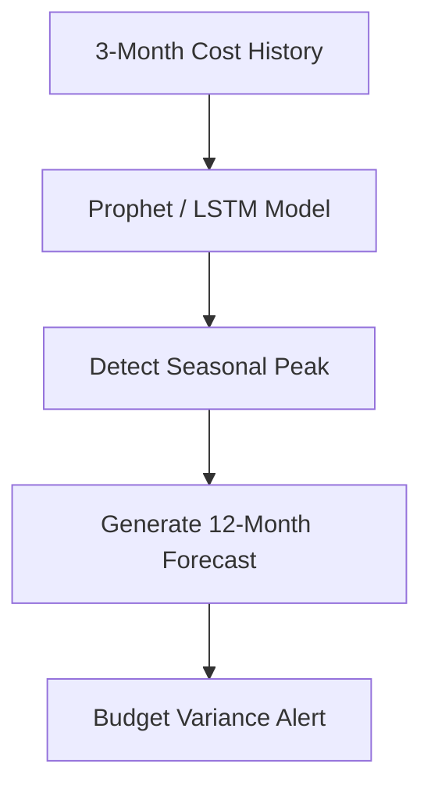

### 6. Security Trust Boundary
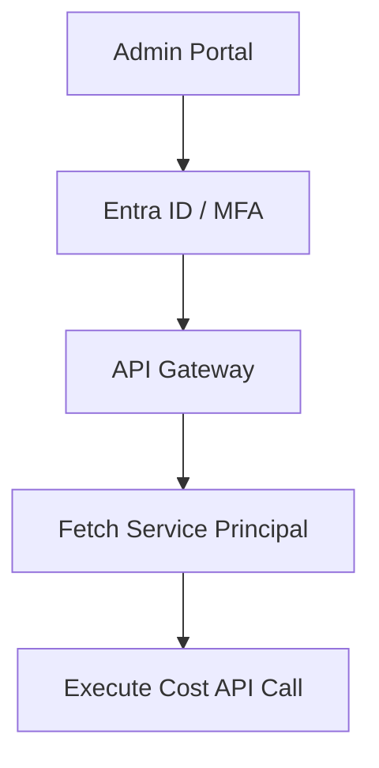

### 7. Global AVD Topology
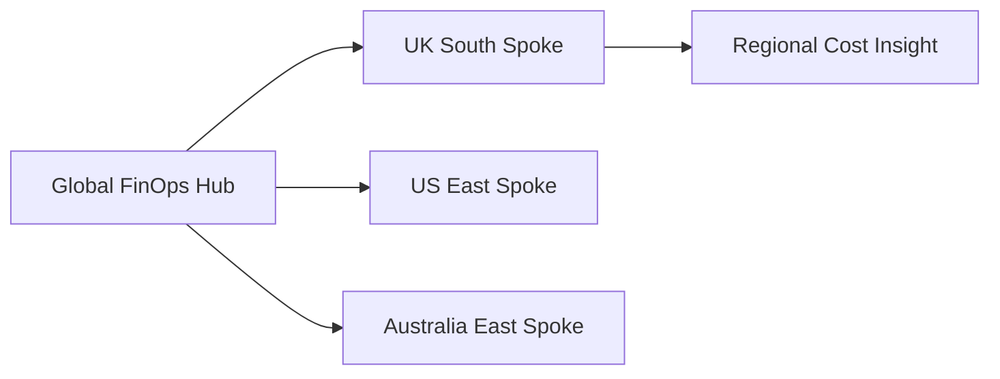

### 8. API Request Lifecycle
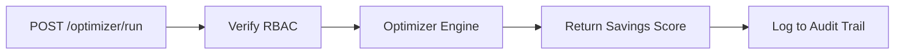

### 9. Multi-Tenant Resource Model
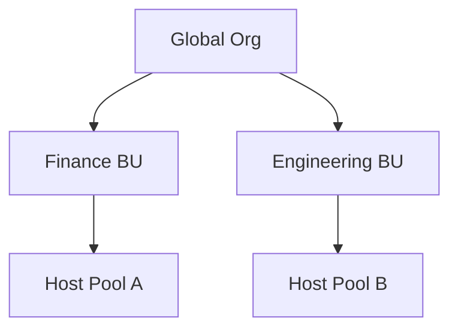

### 10. Monitoring & Telemetry Flow
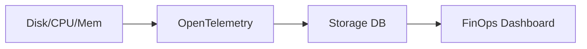

### 11. Disaster Recovery Topology
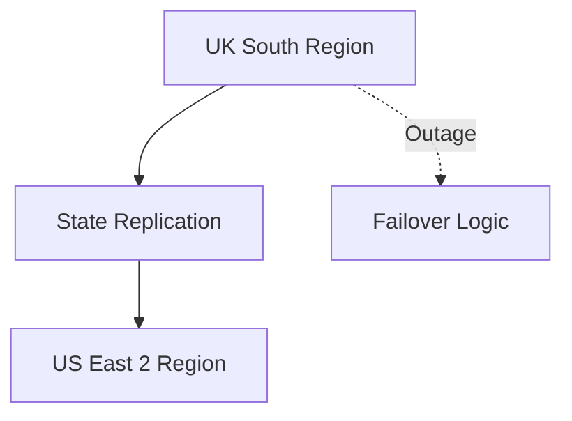

### 12. Chargeback Workflow
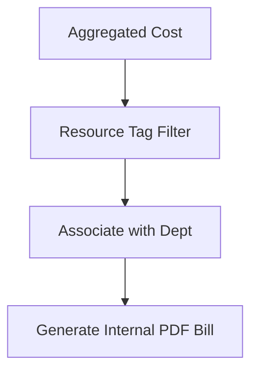

### 13. Sustainability Metrics Flow
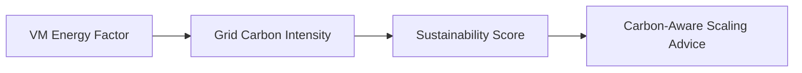

### 14. CI/CD Operations Pipeline
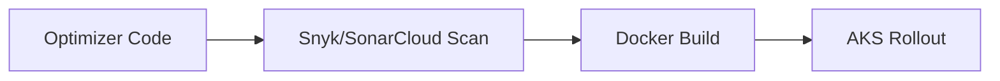

### 15. Executive Governance Workflow
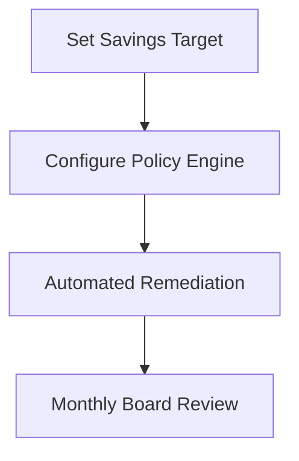

### 16. Idle Shutdown Lifecycle
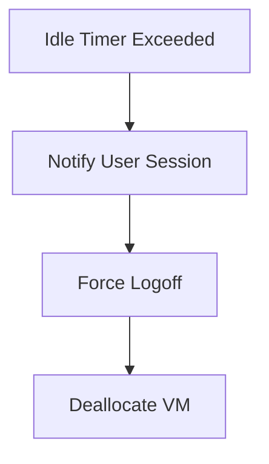

### 17. Identity Federation Architecture
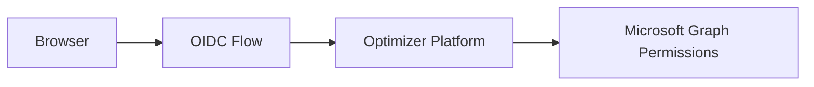

### 18. Budget Alert Workflow
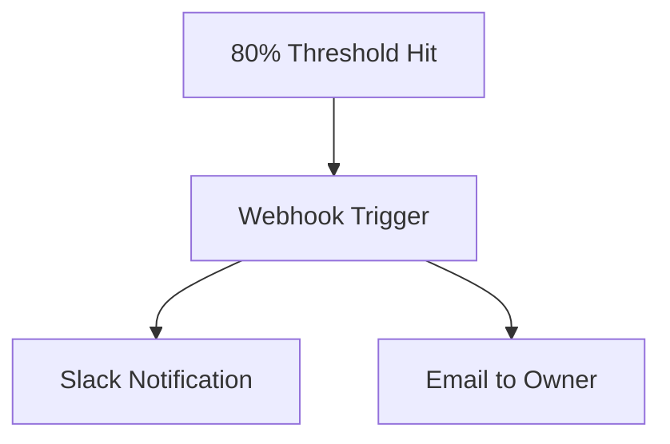

### 19. Global Region Topology
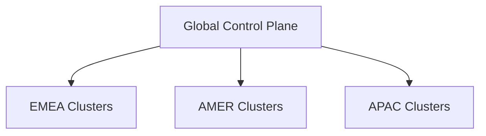

### 20. Savings Realization Model
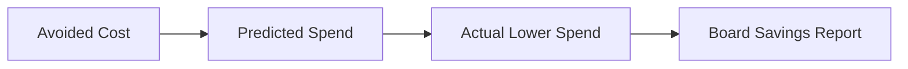

---

## 🛠️ Global Platform Components

### 1. Analytics Engine
The core intelligence layer that continuously scrapes Azure Consumption APIs to build a multi-dimensional view of VDI spend across regions and tenants.

### 2. Optimizer Engine
The decision-making heart of the platform. It applies rightsizing rules, validates SKU availability, and ranks session hosts based on their "Cost Efficiency Score."

### 3. Forecast Engine
Leverages machine learning models to project future cloud spend based on historical growth and planned headcount increases.

---

## 🚀 Environment Deployment

### Terraform Orchestration
```bash
cd terraform/environments/prd
terraform init
terraform apply -auto-approve
```

---
<sub>&copy; 2026 Devopstrio &mdash; Engineering Financial Accountability for the Digital Workspace.</sub>
